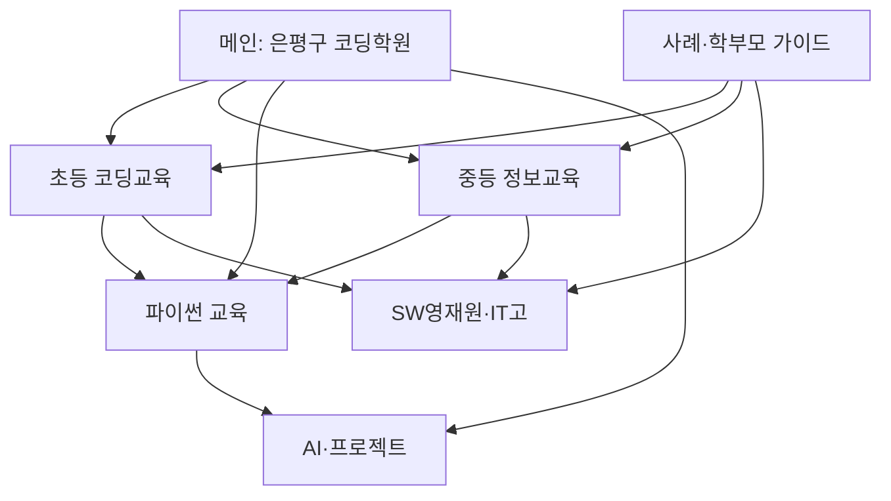

# 써니코딩 홈페이지 지역 SEO 구현 명세

> 이 문서는 써니코딩 홈페이지를 만드는 Codex/개발 AI가 반드시 따라야 할 작업 지침이다.  
> 목적은 **은평구 학부모가 코딩교육을 검색할 때 써니코딩이 발견되고, 신뢰한 뒤 상담으로 연결되게 하는 것**이다.

---

## 0. Codex에게 바로 전달할 실행 명령

아래 문장을 이 파일과 함께 Codex에게 전달한다.

```text
프로젝트 루트의 SUNNYCODING_LOCAL_SEO_WEBSITE_SPEC.md를 처음부터 끝까지 읽고,
현재 홈페이지의 프레임워크·라우팅·콘텐츠·디자인·SEO 상태를 먼저 확인한 뒤
명세대로 실제 코드를 구현해줘.

분석이나 계획만 제시하고 멈추지 말고, 가능한 작업은 바로 구현해.
기존 디자인과 사용자 변경사항은 보존하고, 확인되지 않은 학원 정보·실적·후기·주소·전화번호는 만들지 마.
정보가 부족한 부분만 TODO_CONFIRM_SUNNY로 표시하고 나머지는 완료해.

완료 후에는 다음을 보고해줘.
1. 생성·수정한 파일
2. 페이지별 URL, 대표 키워드, title, H1
3. build/lint/test와 내부 링크·메타데이터 검증 결과
4. Sunny가 확인해야 할 사실 정보
```

---

## 1. 최종 목표

### 가장 중요한 검색 상황

은평구에 거주하는 초·중·고 학부모가 다음과 같이 검색할 때 써니코딩이 관련 결과로 연결되어야 한다.

- 코딩
- 코딩학원
- 초등 코딩
- 중학생 코딩
- 파이썬 학원
- AI 코딩
- 중학교 정보 과목
- 정보 수행평가
- SW영재원
- 선린인터넷고 준비

검색어가 `코딩`처럼 짧더라도 검색엔진이 써니코딩을 **은평구의 학생 전문 코딩학원**으로 이해하도록 지역·대상·교육 분야 신호를 일관되게 제공한다.

### 핵심 성과

1. `은평구 코딩학원` 검색 노출과 클릭 증가
2. `은평구 + 학생 대상/교육과정` 조합 검색 노출 증가
3. 네이버 플레이스·구글 지역 결과와 홈페이지 정보의 일치
4. 검색 방문자의 상담 버튼 클릭과 문의 증가
5. 검색엔진이 각 페이지의 주제를 혼동하지 않도록 페이지별 검색 의도 분리

### 중요한 한계

- 상위 노출이나 1위를 보장한다는 문구를 홈페이지에 쓰지 않는다.
- 검증 근거 없이 `은평구 1등`, `최고`, `유일`이라고 표현하지 않는다.
- 목표는 1등 브랜드가 되는 것이지만, 홈페이지에서는 실제 교육 내용·학생 결과물·합격 실적·후기로 신뢰를 증명한다.

---

## 2. 브랜드와 방문자

### 핵심 방문자

- 은평구·연신내·구산역 생활권의 초등학생 학부모
- 예비 중1 및 중학생 학부모
- 학교 정보 과목과 수행평가를 미리 준비하려는 학부모
- 파이썬·AI·프로젝트 수업을 찾는 학부모
- SW영재원 또는 IT특성화고 진학을 준비하는 학생과 학부모

### 홈페이지가 즉시 전달해야 할 정체성

> 은평구 초·중·고 학생 전문 코딩교육  
> 엔트리·스크래치부터 파이썬·AI 프로젝트, 중학교 정보, SW영재원, IT특성화고 준비까지 학년과 목표에 맞춰 연결하는 학원

`은평구 컴퓨터학원`도 검색 수요를 받기 위한 보조 키워드로 사용하되, 성인 OA·자격증 학원으로 오해하지 않도록 첫 화면에서 **학생 전문 코딩교육**임을 명확히 한다.

### 콘텐츠 작성 원칙

- 학부모가 이해하기 쉬운 말로 결론부터 설명한다.
- 프로그램 이름만 나열하지 말고 아이가 무엇을 생각하고 만들며 성장하는지 보여준다.
- 교육과정, 학생 프로젝트, 지도 방식, 진학 준비가 서로 어떻게 연결되는지 설명한다.
- 같은 슬로건을 모든 페이지에서 반복하지 않는다.
- `코딩은 생각을 풀어내는 과정이다`라는 문장은 브랜드 소개에서 한 번만 사용한다.
- 기존 홈페이지와 사용자 제공 자료에서 확인되는 사실만 사용한다.
- 실적은 연도·기관·결과를 정확히 확인한 뒤 표시한다.
- 학생 이름·사진·후기는 공개 동의가 확인된 자료만 사용한다.

---

## 3. 키워드 전략의 핵심 원칙

### 페이지별 키워드 담당제

각 핵심 키워드는 아래 원칙에 따라 **담당 페이지 한 곳**에서만 집중적으로 다룬다.

1. 각 페이지는 대표 키워드를 정확히 하나만 가진다.
2. 같은 대표 키워드를 두 페이지의 title 또는 H1에 사용하지 않는다.
3. 다른 페이지에서 그 키워드를 설명해야 할 때는 짧게 언급하고 담당 페이지로 내부 링크한다.
4. 보조 키워드는 검색 의도와 본문 내용이 실제로 연결될 때만 사용한다.
5. 새 페이지를 만들 때는 먼저 이 문서의 키워드 지도에 대표 키워드를 등록한다.
6. 기존 담당 페이지와 검색 의도가 겹치면 새 페이지를 만들지 말고 기존 페이지를 강화한다.
7. 블로그 글 제목도 홈페이지 핵심 페이지의 대표 키워드와 완전히 같게 만들지 않는다.

대표 키워드 하나만 검색된다는 뜻은 아니다. 한 페이지는 대표 키워드 하나를 중심으로 같은 의도의 여러 검색어에도 노출될 수 있다. 예를 들어 초등 페이지는 `은평구 초등 코딩학원`을 대표로 삼되 `초등 코딩`, `엔트리코딩`, `스크래치코딩`처럼 같은 학부모가 이어서 궁금해할 표현을 함께 다룬다.

예시:

- `은평구 초등 코딩학원`의 담당 페이지는 `/elementary-coding`이다.
- 메인에서는 `초등 코딩교육`을 한두 문장으로 소개하고 `/elementary-coding`으로 연결한다.
- 메인의 title과 H1에는 `은평구 초등 코딩학원`을 별도 대표 키워드처럼 반복하지 않는다.
- `/python`은 `은평구 파이썬 학원`에 집중하고 초등 과정 전체를 다시 복제하지 않는다.

### 절대 하지 말 것

- 모든 키워드를 메인페이지에 몰아넣지 않는다.
- 같은 키워드를 문장마다 반복하지 않는다.
- 글자색을 배경색과 같게 하는 숨김 키워드를 사용하지 않는다.
- 지역명만 바꾼 복제 페이지를 만들지 않는다.
- 내용이 거의 같은 `엔트리코딩`, `스크래치코딩`, `로봇코딩` 페이지를 각각 만들지 않는다.
- 실제로 운영하지 않는 교육과정을 검색량 때문에 넣지 않는다.
- 검색량 숫자를 홈페이지 방문자에게 홍보 문구로 노출하지 않는다.
- 키워드 밀도 몇 퍼센트 같은 기계적인 반복 목표를 사용하지 않는다.

### 반드시 지킬 것

- 페이지 하나에는 대표 검색 의도 하나와 대표 키워드 하나를 둔다.
- 관련 표현은 3~6개만 자연스럽게 함께 사용한다.
- 대표 키워드는 가능하면 고유한 `title`, H1, 첫 소개 문단에 각각 자연스럽게 사용한다.
- 모든 페이지에 서로 다른 `title`, meta description, H1, 본문, canonical을 둔다.
- 키워드보다 학부모의 질문에 제대로 답하는 것을 우선한다.
- 독립 페이지는 실제 교육과정·사례·사진·FAQ 등 고유한 내용을 충분히 제공할 수 있을 때만 만든다.
- 내용이 부족한 주제는 우선 상위 교육 페이지의 섹션으로 두고, 자료가 쌓이면 독립 페이지로 확장한다.

---

## 4. 키워드 역할 구분

| 역할 | 키워드 | 적용 방식 |
|---|---|---|
| 최우선 지역 전환 | 은평구 코딩학원 | 메인페이지 대표 키워드 |
| 지역 수요 보완 | 은평구 컴퓨터학원 | 메인 title·소개·FAQ에서 보조 사용 |
| 초등 등록 | 은평구 초등 코딩학원, 초등 컴퓨터학원 | 초등 교육 페이지 |
| 중등 등록 | 은평구 중학생 코딩학원 | 중등 교육 페이지 |
| 과목 고민 | 중학교 정보 과목, 중1 정보 수행평가, 정보 수행평가 | 중등 교육 페이지와 학부모 가이드 |
| 파이썬 등록 | 은평구 파이썬 학원, 초등 파이썬, 중학생 파이썬 | 파이썬 교육 페이지 |
| AI·프로젝트 관심 | AI코딩, 로봇코딩, 아두이노코딩 | AI·프로젝트 페이지 또는 초등 페이지의 고유 섹션 |
| 초등 입문 관심 | 엔트리코딩, 스크래치코딩 | 초등 교육과정 안에서 함께 설명 |
| 영재교육 준비 | 은평구 SW영재원 준비, 서울교대 SW영재원 | SW영재원 페이지 |
| IT고 진학 | 선린인터넷고 입시, IT특성화고 준비 | IT고 입시 페이지 |
| 근거리 탐색 | 연신내 코딩학원, 구산역 코딩학원 | 오시는 길 페이지와 사이트 공통 지역 정보 |
| 질문형 정보 | 몇 학년부터, 비용, 선택 기준, 후기, AI 시대 코딩 필요성 | 학부모 가이드 글 |
| 조건부 키워드 | 코딩자격증 | 실제 관련 교육을 운영할 때만 가이드 또는 교육과정에 사용 |

### 전국형 검색어 사용법

`코딩학원`, `엔트리코딩`, `AI코딩`, `스크래치코딩`, `파이썬학원`은 검색 관심이 큰 표현이지만 전국 단위 경쟁과 비학부모 검색도 섞여 있다.

- 메인 판매 키워드로 단독 사용하지 않는다.
- `은평구`, `초등학생`, `중학생`, `학부모`, `수업` 같은 실제 대상 표현과 자연스럽게 연결한다.
- 전국형 정보 검색은 학부모 가이드로 유입시키고, 관련 지역 교육 페이지로 내부 링크한다.

---

## 5. 권장 사이트 구조

현재 라우팅 방식과 프레임워크를 유지하되 아래 검색 의도를 각각 고유 URL로 제공한다. 영문 URL은 예시이며 기존 URL이 있다면 기존 주소와 링크 자산을 최대한 보존한다.

| 우선순위 | 권장 URL | 페이지 | 대표 키워드 | 관련 키워드 |
|---:|---|---|---|---|
| 1 | `/` | 메인 | 은평구 코딩학원 | 은평구 컴퓨터학원, 학생 코딩교육 |
| 2 | `/elementary-coding` | 초등 코딩교육 | 은평구 초등 코딩학원 | 초등 컴퓨터학원, 초등 코딩, 엔트리코딩, 스크래치코딩, 로봇코딩 |
| 3 | `/middle-school-coding` | 중등 코딩·정보교육 | 은평구 중학생 코딩학원 | 중학교 정보 과목, 중1 정보 수행평가, 예비중1 코딩 |
| 4 | `/python` | 파이썬 교육 | 은평구 파이썬 학원 | 초등 파이썬, 중학생 파이썬, 파이썬 프로젝트 |
| 5 | `/ai-projects` | AI·프로젝트 교육 | 은평구 AI 코딩학원 | AI코딩, 아두이노코딩, 로봇코딩, 데이터·게임 프로젝트 |
| 6 | `/sw-gifted` | SW영재원 준비 | 은평구 SW영재원 준비 | 서울교대 SW영재원, 면접, 지원 준비 |
| 7 | `/sunrin-admissions` | IT특성화고 입시 | 선린인터넷고 입시 준비 | 특별전형, 포트폴리오, 면접, IT특성화고 |
| 8 | `/results` | 합격·성장 사례 | 써니코딩 합격 사례 | SW영재원 합격, 선린인터넷고 합격, 학생 프로젝트 |
| 9 | `/location` | 학원·오시는 길 | 연신내 코딩학원 | 구산역 코딩학원, 은평구 코딩학원 오시는 길 |
| 10 | `/guides` | 학부모 가이드 | 코딩교육 학부모 가이드 | 시작 학년, 비용, 학원 선택, AI 시대 코딩교육 |

### 대표 키워드 소유권

아래 대표 키워드는 지정된 URL의 title·H1·도입부에서만 집중적으로 사용한다.

| 대표 키워드 | 유일한 담당 URL | 다른 페이지에서의 처리 |
|---|---|---|
| 은평구 코딩학원 | `/` | 브랜드·위치 설명에 꼭 필요할 때만 짧게 언급 |
| 은평구 초등 코딩학원 | `/elementary-coding` | `초등 코딩교육`이라는 자연어로 소개 후 링크 |
| 은평구 중학생 코딩학원 | `/middle-school-coding` | `중등 코딩·정보교육`으로 소개 후 링크 |
| 은평구 파이썬 학원 | `/python` | `학생 파이썬 과정`으로 소개 후 링크 |
| 은평구 AI 코딩학원 | `/ai-projects` | `AI·프로젝트 교육`으로 소개 후 링크 |
| 은평구 SW영재원 준비 | `/sw-gifted` | `SW영재원 준비 과정`으로 소개 후 링크 |
| 선린인터넷고 입시 준비 | `/sunrin-admissions` | `IT특성화고 진학 준비`로 소개 후 링크 |
| 써니코딩 합격·성장 사례 | `/results` | 사례 한두 개만 요약하고 전체 사례로 링크 |
| 연신내 코딩학원 | `/location` | footer에는 주소·지도 링크만 간결히 제공 |
| 코딩교육 학부모 가이드 | `/guides` | 개별 질문 글로 연결 |

대표 키워드의 단어 일부가 자연스럽게 겹치는 것은 괜찮다. 하지만 두 페이지가 동일한 질문에 같은 답을 제공하거나, title과 H1에서 같은 정확 일치 키워드를 놓고 경쟁하게 만들면 안 된다.

### 단계적 공개

모든 페이지를 얇게 한꺼번에 만들지 않는다.

1. 1차: 메인, 초등, 중등, 파이썬, 오시는 길
2. 2차: AI·프로젝트, SW영재원, 선린인터넷고, 합격·성장 사례
3. 3차: 학부모 가이드와 세부 사례 콘텐츠

AI·프로젝트를 설명할 고유 수업·사진·학생 결과물이 부족하면 `/ai-projects`를 억지로 만들지 말고 초등·중등 페이지 안의 섹션으로 먼저 제공한다.

---

## 6. 페이지별 SEO 문구와 필수 내용

아래 문구는 초안이다. 기존 사이트의 정확한 학원명·교육대상·운영 내용과 맞는지 확인한 후 사용한다.

### 6.1 메인 `/`

- 대표 키워드: `은평구 코딩학원`
- 보조 키워드: `은평구 컴퓨터학원`, `초·중·고 학생 코딩교육`
- title 초안: `은평구 코딩학원 | 초·중·고 학생 전문 써니코딩`
- H1 초안: `은평구 초·중·고 학생 전문 코딩학원`
- meta description 초안:

```text
은평구 연신내·구산역 생활권의 초·중·고 학생 전문 코딩학원입니다.
엔트리·파이썬·AI 프로젝트부터 중학교 정보, SW영재원, IT특성화고 준비까지
학년과 목표에 맞춰 지도합니다.
```

필수 섹션:

1. 첫 화면: 지역 + 학생 대상 + 코딩교육 + 상담 CTA
2. 학년별 빠른 선택: 초등 / 중등 / 고등·진학
3. 교육 로드맵: 입문 → 파이썬·프로젝트 → 정보 과목·진학
4. 써니코딩의 지도 방식
5. 확인 가능한 최근 합격·성장 사례
6. 학생 프로젝트
7. 학부모 FAQ
8. 위치·통학권·상담 CTA

메인의 첫 CTA는 `학년별 수업 상담`, 보조 CTA는 `교육과정 보기`로 한다.

### 6.2 초등 코딩교육 `/elementary-coding`

- 대표 키워드: `은평구 초등 코딩학원`
- title 초안: `은평구 초등 코딩학원 | 엔트리부터 파이썬까지`
- H1 초안: `은평구 초등학생을 위한 단계별 코딩교육`

필수 내용:

- 몇 학년부터 어떤 수업을 시작하는지
- 엔트리·스크래치의 역할과 다음 단계
- 단순 따라 만들기와 사고력·프로젝트 수업의 차이
- 로봇·AI·파이썬으로 이어지는 과정
- 학년별 수업 예시와 실제 결과물
- 처음 배우는 아이의 레벨 확인 방법
- `초등 코딩은 몇 학년부터 시작하나요?` FAQ

### 6.3 중등 코딩·정보교육 `/middle-school-coding`

- 대표 키워드: `은평구 중학생 코딩학원`
- title 초안: `은평구 중학생 코딩학원 | 정보 과목·수행평가 준비`
- H1 초안: `중학교 정보 과목과 프로젝트를 연결하는 코딩교육`

필수 내용:

- 중학교 정보 과목에서 배우는 영역
- 예비 중1이 미리 준비하면 좋은 기초
- 정보 수행평가를 대신 해주는 것이 아니라 아이가 스스로 해결하도록 지도하는 범위
- 파이썬·알고리즘·프로젝트 학습 연결
- 학교별 평가가 다를 수 있다는 안내
- 고등 정보·세특·IT 진로로 이어지는 로드맵

### 6.4 파이썬 교육 `/python`

- 대표 키워드: `은평구 파이썬 학원`
- title 초안: `은평구 파이썬 학원 | 초등 고학년·중학생 프로젝트 수업`
- H1 초안: `문법을 넘어 직접 만드는 학생 파이썬 수업`

필수 내용:

- 권장 시작 수준
- 기초 문법 → 문제 해결 → 프로젝트 단계
- 초등 고학년과 중학생 수업 차이
- 학생 프로젝트 예시
- 성인 취업 학원이 아니라 학생 교육 중심임을 명확히 안내
- 수업 후 아이가 할 수 있게 되는 것

### 6.5 AI·프로젝트 교육 `/ai-projects`

- 대표 키워드: `은평구 AI 코딩학원`
- title 초안: `은평구 AI 코딩학원 | 로봇·아두이노 프로젝트 교육`
- H1 초안: `AI를 사용하는 아이에서 직접 설계하는 아이로`

필수 내용:

- 생성형 AI 사용법과 코딩교육의 관계
- AI가 코드를 만들더라도 기본 코딩지식과 검증 능력이 필요한 이유
- 로봇·아두이노·데이터·게임 등 실제 운영하는 프로젝트
- 결과물보다 기획·수정·설명 과정을 평가하는 방식
- 운영하지 않는 프로젝트는 예시로 만들지 않음

### 6.6 SW영재원 `/sw-gifted`

- 대표 키워드: `은평구 SW영재원 준비`
- title 초안: `은평구 SW영재원 준비 | 지원부터 면접·프로젝트까지`
- H1 초안: `아이의 사고력과 프로젝트 경험을 연결하는 SW영재원 준비`

필수 내용:

- 지원 대상과 준비 시기
- 사고력·프로젝트·서류·면접의 역할
- 기관별 모집요강이 매년 달라질 수 있다는 안내
- 사용자 제공 자료로 확인된 연도별 합격 실적
- 합격 보장 표현 금지
- 최신 모집요강은 공식 기관 링크와 기준일 표시

### 6.7 선린인터넷고·IT특성화고 `/sunrin-admissions`

- 대표 키워드: `선린인터넷고 입시 준비`
- title 초안: `선린인터넷고 입시 준비 | 포트폴리오·면접·코딩 로드맵`
- H1 초안: `중학생 때부터 쌓는 IT특성화고 준비`

필수 내용:

- 진학을 고민하는 시점
- 코딩 실력, 프로젝트, 포트폴리오, 면접의 관계
- 실제 지도 가능한 범위
- 사용자 제공 자료로 확인된 합격·지도 사례
- 전형 내용에 공식 출처와 기준연도 표시
- 합격 보장 및 과장 문구 금지

### 6.8 합격·성장 사례 `/results`

- 목적: 검색엔진용 숫자 나열이 아니라 학부모의 신뢰 형성
- 연도, 기관, 교육 과정, 학생의 성장 과정을 확인 가능한 범위에서 표시
- 합격 사례와 일반 프로젝트 성장 사례를 함께 제공
- 학생 개인정보와 후기 사용 동의를 확인
- 각 사례에서 관련 교육 페이지로 내부 링크

### 6.9 학원·오시는 길 `/location`

- 대표 키워드: `연신내 코딩학원`
- 보조 키워드: `구산역 코딩학원`, `은평구 코딩학원 오시는 길`

필수 내용:

- 공식 학원명
- 정확한 주소와 지도
- 전화번호와 상담 방법
- 가까운 역·버스·실제 통학권
- 방문 상담 방법
- 수업 요일·시간·주차 정보는 확인된 내용만 표시

연신내와 구산역의 이름만 바꾼 복제 페이지는 만들지 않는다.

---

## 7. 메인페이지 권장 화면 순서

1. **Hero**
   - H1: 은평구 학생 전문 코딩학원
   - 한 줄 설명: 대상 + 교육 범위 + 차별점
   - CTA: 학년별 수업 상담
2. **학부모 고민 선택**
   - 처음 시작하는 초등학생
   - 중학교 정보 과목·수행평가
   - 파이썬·AI 프로젝트
   - SW영재원·IT고 진학
3. **학년별 교육과정**
4. **써니코딩의 수업 방식**
5. **학생 프로젝트와 성장**
6. **합격·진학 실적**
7. **학부모가 자주 묻는 질문**
8. **오시는 길과 최종 상담 CTA**

각 카드와 CTA는 설명만 표시하지 말고 관련 고유 페이지로 일반 HTML 링크를 제공한다.

---

## 8. 키워드 배치 규칙

대표 키워드는 아래 위치에서 문맥에 맞게 사용한다.

| 위치 | 규칙 |
|---|---|
| URL | 짧고 읽기 쉬운 고유 URL 사용 |
| title | 대표 키워드를 앞쪽에 두고 브랜드명 포함 |
| meta description | 지역·대상·교육 내용·차별점·행동을 자연스럽게 요약 |
| H1 | 페이지마다 하나, title을 그대로 복사하지 않아도 됨 |
| 첫 문단 | 150~200자 안에 지역·대상·페이지 주제를 명확히 설명 |
| H2 | 학부모의 실제 질문과 교육과정 중심으로 작성 |
| 본문 | 정확 일치 표현을 억지로 반복하지 않고 동의어와 자연어 사용 |
| 이미지 alt | 이미지에 실제 보이는 내용만 설명하며 키워드를 끼워 넣지 않음 |
| 내부 링크 | `자세히 보기`보다 `초등 코딩교육 보기`처럼 목적이 보이는 문구 사용 |
| footer | 공식 학원명·주소·전화·지역·핵심 교육대상 일관되게 표시 |

문장 예시:

- 좋은 예: `은평구에서 초등학생 코딩학원을 찾는 학부모님께 아이의 학년과 경험에 맞는 시작 단계를 안내합니다.`
- 나쁜 예: `은평구 코딩학원 써니코딩은 은평구 초등 코딩학원이며 은평구 컴퓨터학원입니다.`

---

## 9. 내부 링크 구조



구현 원칙:

- 모든 핵심 페이지는 메인에서 두 번 이내 클릭으로 접근할 수 있어야 한다.
- 상단 메뉴, 본문 관련 카드, footer를 사용하되 과도하게 같은 링크를 반복하지 않는다.
- 학부모 가이드 글은 가장 관련 있는 교육 페이지 하나를 주 CTA로 연결한다.
- 교육 페이지는 관련 사례와 오시는 길·상담 페이지로 연결한다.
- breadcrumb를 화면과 구조화 데이터에 함께 제공한다.

---

## 10. 지역 SEO 필수 조건

은평구 사용자가 `코딩`처럼 짧게 검색할 때 지역 결과에 연결되려면 웹페이지 키워드만으로는 부족하다. 다음 지역 신호를 함께 맞춘다.

### 홈페이지

- 공식 학원명, 주소, 전화번호를 footer와 오시는 길에 동일하게 표시
- 연신내·구산역 등 실제 접근 지역을 과장 없이 설명
- 실제 위치 지도와 방문 안내
- 모바일에서 바로 전화·상담 가능한 버튼
- 운영 시간은 정확한 정보만 표시

### 외부 지역 정보와 일치

- 네이버 플레이스
- Google 비즈니스 프로필
- 네이버 블로그 프로필
- 학원 공식 SNS

위 채널의 학원명·주소·전화번호·홈페이지 URL·교육대상을 홈페이지와 동일하게 유지한다. Codex가 외부 계정에 접근할 수 없다면 코드로 꾸며내지 말고 `POST_LAUNCH_LOCAL_SEO_CHECKLIST.md`에 수동 작업으로 남긴다.

### 후기

- 실제 학부모가 작성하고 공개 동의가 확인된 후기만 사용
- 별점이나 후기 수를 만들지 않음
- 후기 원문을 과도하게 수정하지 않음
- 가능하면 학년·수업 유형·경험 시점을 함께 표시하되 개인정보는 보호

---

## 11. 기술 SEO 구현

현재 코드에서 이미 해결된 항목은 유지하고, 미해결 항목만 수정한다.

### URL과 색인

- 실제 홈페이지 콘텐츠는 루트 `/`에서 HTTP 200으로 제공
- `/default/`, http, non-www 등 중복 주소가 있다면 대표 주소로 서버 301 통일
- meta refresh를 대표 리디렉션으로 사용하지 않음
- 각 페이지에 self-referencing canonical 설정
- 삭제·변경되는 기존 URL은 가장 관련 있는 새 URL로 301 연결
- 검색 가치가 있는 페이지를 JavaScript 클릭 이벤트만으로 연결하지 않고 일반 `<a href>` 링크로 연결

### 메타데이터

- 모든 페이지에 고유 title, description, H1
- Open Graph title, description, URL, 1200×630 대표 이미지
- 실제 서비스 도메인의 절대 URL 사용
- 한글 인코딩은 UTF-8로 통일
- 존재하지 않는 이미지 확장자와 404 미디어 제거

### robots와 sitemap

- `/robots.txt`를 HTTP 200으로 제공
- 검색 허용 페이지가 포함된 `/sitemap.xml`을 HTTP 200으로 제공
- canonical URL만 sitemap에 포함
- 관리자·미완성·검색결과·중복 페이지는 sitemap에서 제외
- 공개 전 환경은 실수로 색인되지 않도록 하고, 운영 배포 시 차단 설정을 제거했는지 확인

### 구조화 데이터

실제 확인된 정보만 사용한다.

- 홈페이지: `EducationalOrganization` 또는 적절한 지역 학원 타입
- 학원 정보: 공식 이름, URL, 주소, 전화번호, 운영 시간, 지도 좌표
- 하위 페이지: `BreadcrumbList`
- 실제 교육과정 정보가 충분한 경우에만 `Course`
- 화면에 보이지 않는 후기·평점·실적을 구조화 데이터에만 넣지 않음
- JSON-LD 문법 오류와 trailing comma가 없어야 함
- 공식 구조화 데이터 검사 도구에서 파싱 오류 0건 확인

### 성능과 접근성

- 이미지 WebP/AVIF 우선, 정확한 width/height, 반응형 srcset
- 첫 화면 핵심 이미지 외에는 lazy loading
- 폰트·이미지·동영상 용량 최적화
- 동영상은 올바른 MIME 타입과 poster 제공
- 모바일에서 글자·버튼·상담 CTA가 잘 보이게 함
- 키보드 탐색, label, focus 상태, 색상 대비 확보
- 장식 이미지는 빈 alt, 정보 이미지는 실제 내용을 설명하는 alt 제공

---

## 12. 학부모 가이드 콘텐츠

아래 주제는 메인페이지에 모두 넣지 말고 `/guides`의 개별 글로 작성한다.

1. 초등 코딩은 몇 학년부터 시작하면 좋을까?
2. 엔트리와 스크래치, 무엇이 다를까?
3. 초등 고학년이 파이썬을 시작해도 될까?
4. AI가 코딩해도 아이가 코딩을 배워야 하는 이유
5. 중학교 정보 과목에서는 무엇을 배울까?
6. 중1 정보 수행평가는 어떻게 준비해야 할까?
7. 코딩학원 선택 시 학부모가 확인할 기준
8. 로봇코딩과 아두이노 수업의 차이
9. SW영재원 준비는 언제 시작해야 할까?
10. 선린인터넷고 준비에서 프로젝트가 중요한 이유

각 글의 규칙:

- 질문에 먼저 답한다.
- 써니코딩 홍보로 시작하지 않는다.
- 구체적인 학년·상황·판단 기준을 제공한다.
- 관련 교육 페이지 하나에 자연스럽게 연결한다.
- 공식 제도·모집요강은 출처와 기준일을 표시한다.
- 학부모가 검색할 법한 표현을 제목과 소제목에 자연스럽게 사용한다.

---

## 13. 사실 정보 보호 규칙

다음 정보는 기존 코드·공식 홈페이지·사용자 제공 원본에서 정확히 확인한 뒤 사용한다.

- 공식 상호가 `써니코딩컴퓨터학원`인지 `써니코딩컴퓨터교습소`인지
- 주소, 전화번호, 상담 채널
- 수업 대상 학년
- 수업 요일·시간·정원·주차
- 개원 연도와 대표 경력
- SW영재원 합격 연도·인원
- 선린인터넷고 및 IT특성화고 합격 실적
- 대회 수상·프로젝트 실적
- 수강료
- 학부모 후기와 학생 사진 공개 동의

확인되지 않은 값은 추측하지 말고 다음 형식으로 관리한다.

```text
TODO_CONFIRM_SUNNY: [확인이 필요한 항목]
```

미확인 정보를 임의의 숫자나 일반적인 학원 정보로 채우지 않는다.

---

## 14. 구현 순서

### P0: 현재 상태 확인과 치명적 오류 수정

1. 프레임워크, 라우팅, 기존 URL, 배포 방식 확인
2. 기존 콘텐츠·디자인·이미지·사용자 변경사항 확인
3. 루트와 `/default/` 등 중복 URL·canonical·리디렉션 확인
4. UTF-8, JSON-LD 문법, 404 이미지·동영상 확인
5. robots.txt와 sitemap.xml 상태 확인

### P1: 핵심 지역 검색 페이지

1. 메인
2. 초등 코딩교육
3. 중등 코딩·정보교육
4. 파이썬 교육
5. 오시는 길

각 페이지에 고유 title, description, H1, 본문, CTA, 내부 링크를 구현한다.

### P2: 전문성과 신뢰

1. AI·프로젝트
2. SW영재원
3. 선린인터넷고·IT특성화고
4. 합격·성장 사례

### P3: 지속적인 검색 유입

1. 학부모 가이드 구조
2. 우선 글 5개
3. 관련 페이지 내부 링크
4. 게시일·수정일·작성자·공식 출처 표시

---

## 15. 완료 조건

### 코드 품질

- 프로젝트의 package manager와 기존 명령을 사용
- build 성공
- lint 성공
- typecheck 성공
- 기존 테스트와 새로 추가한 관련 테스트 성공
- 기존 사용자 기능과 디자인의 회귀 없음

### SEO 품질

- 대표 키워드마다 유일한 담당 URL이 있음
- 두 핵심 페이지가 같은 정확 일치 대표 키워드를 title·H1에 함께 사용한 경우 0건
- 두 핵심 페이지가 사실상 같은 검색 질문에 답하는 중복 콘텐츠 0건
- 핵심 페이지별 title 중복 0건
- 핵심 페이지별 meta description 중복 0건
- 페이지별 H1 정확히 1개
- canonical 누락·충돌 0건
- 핵심 내부 링크 404 0건
- sitemap과 robots HTTP 200
- JSON-LD 파싱 오류 0건
- 운영 페이지에 의도하지 않은 `noindex` 없음
- 모바일 화면에서 상담 CTA 사용 가능
- 공식 학원명·주소·전화번호가 모든 노출 위치에서 일치

### 콘텐츠 품질

- 메인 첫 화면에서 5초 안에 `은평구`, `학생`, `코딩교육`을 이해할 수 있음
- 각 페이지가 서로 다른 학부모 질문에 답함
- 키워드 나열처럼 읽히는 문장 없음
- 사실이 아닌 실적·후기·교육과정 없음
- 페이지마다 관련 사례 또는 실제 교육 근거가 있음
- 모든 핵심 페이지에 명확한 상담 또는 다음 단계 CTA가 있음

---

## 16. 구현 완료 보고 형식

Codex는 작업을 마친 뒤 아래 표를 채워 보고한다.

| URL | 대표 키워드 | title | H1 | 상태 |
|---|---|---|---|---|
| `/` | 은평구 코딩학원 |  |  |  |
| `/elementary-coding` | 은평구 초등 코딩학원 |  |  |  |
| `/middle-school-coding` | 은평구 중학생 코딩학원 |  |  |  |
| `/python` | 은평구 파이썬 학원 |  |  |  |
| `/ai-projects` | 은평구 AI 코딩학원 |  |  |  |
| `/sw-gifted` | 은평구 SW영재원 준비 |  |  |  |
| `/sunrin-admissions` | 선린인터넷고 입시 준비 |  |  |  |
| `/results` | 써니코딩 합격·성장 사례 |  |  |  |
| `/location` | 연신내 코딩학원 |  |  |  |
| `/guides` | 코딩교육 학부모 가이드 |  |  |  |

추가 보고:

- 변경 파일 목록
- 대표 키워드 중복·검색 의도 충돌 검사 결과
- 실행한 검증 명령과 결과
- 301 리디렉션 목록
- 미확인 사실 `TODO_CONFIRM_SUNNY` 목록
- 배포 후 Search Console·네이버 서치어드바이저에서 할 작업
- 다음 30일 동안 먼저 작성할 학부모 가이드 5개

---

## 17. 최종 판단 기준

이 홈페이지의 성공 기준은 키워드가 많이 들어갔는지가 아니다.

> 은평구 학부모가 코딩교육을 검색했을 때  
> 검색엔진은 써니코딩을 지역의 학생 전문 코딩학원으로 이해하고,  
> 학부모는 첫 화면에서 우리 아이에게 맞는 교육인지 판단하며,  
> 교육과정·사례·위치·상담으로 자연스럽게 이동할 수 있어야 한다.

모든 구현 판단은 이 기준을 우선한다.
